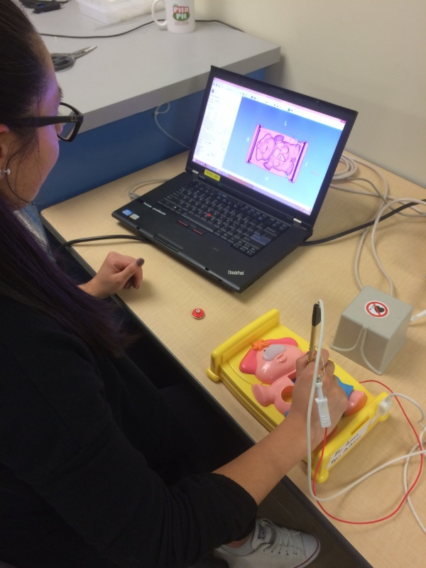

# Operation Pig

Instructions for setting up 3D Slicer based "Operation" game for outreach events for kids.

# Setup instructions

## Overview

This repository contains CT scan of My First Operation by MB Games, but it can be adapted to other variants of the game.

We use free, open-source software ([3D Slicer](https://www.slicer.org) and [SlicerIGT](http://www.slicer.igt.org)) and an off-the-shelf position tracker.

The provided configuration file uses an NDI Ascension TrakSTAR 3DG electromagnetic tracker, but a wide range of other devices can be used, such as [OptiTrack Duo](https://optitrack.com/products/v120-duo/) or if lower accuracy is acceptable then even a [simple webcam](https://youtu.be/MOqh6wgOOYs). Submit an issue tracker for getting help with device setup.

## Sensor placement

